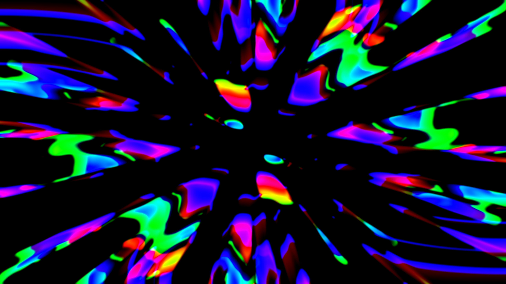

# Video feedback — Windows build (RTX 3090)

<table>
  <tr>
    <td></td>
    <td></td>
  </tr>
  <tr>
    <td></td>
    <td></td>
  </tr>
</table>

Same dynamical system as the Linux/Mac versions. 12 toggleable layers, each
in its own .glsl file under `shaders/layers/`.

Camera is via Media Foundation (not V4L2 like the Linux version).

## Quick start — prebuilt binary

Grab `feedback-windows-x64.zip` from [GitHub Releases](../../releases),
unzip, double-click `feedback.exe`. No DLLs, no toolchain, nothing to
install. The binary statically links GLFW and GLEW.

Launching with no arguments (the double-click path) drops you into a
short console mode picker — pick default / fullscreen / gallery / 4K /
8-bit study / load preset, press Enter, go. Any CLI flag skips the
picker so scripted launches still work.

If you want to build from source, read on.

## Two ways to build

### Option A: MSYS2 / MinGW (fastest, recommended)

1. Install MSYS2 from https://www.msys2.org/
2. Open the "MSYS2 MINGW64" shell (the blue one, not the UCRT or CLANG ones).
3. Install deps:

       pacman -S --needed mingw-w64-x86_64-gcc mingw-w64-x86_64-glfw \
                          mingw-w64-x86_64-glew make

4. `cd` to this folder and build:

       make

5. Run:

       ./feedback.exe

6. Build a redistributable zip (exe + shaders + presets, no DLLs):

       make dist

   Produces `feedback-windows-x64.zip` — what to upload to a release.

### Option B: Visual Studio 2022 + vcpkg

1. Install Visual Studio 2022 with the "Desktop development with C++" workload.
2. Install vcpkg (one-time):

       git clone https://github.com/microsoft/vcpkg C:\vcpkg
       C:\vcpkg\bootstrap-vcpkg.bat
       C:\vcpkg\vcpkg integrate install
       C:\vcpkg\vcpkg install glfw3:x64-windows glew:x64-windows

3. Open "x64 Native Tools Command Prompt for VS 2022" in this folder.
4. Run `build_msvc.bat`.
5. Run `feedback.exe`.

(Edit `VCPKG_ROOT` in build_msvc.bat if you installed vcpkg somewhere else.)

## Running

You can launch the exe either from the source folder (shaders resolve via
relative path `shaders/...`) or from anywhere — the app also looks for a
`shaders` folder next to the exe. So if you want a standalone distribution,
just copy `feedback.exe` and the `shaders/` directory into one folder.

## CLI flag cookbook

Full flag list: `./feedback.exe --help`. Common recipes below — pick one
as a starting point and tweak from there.

### Quick start

```
./feedback.exe
```

Windowed 1280×720, sim matches window, precision RGBA32F, 60 fps. The default.

```
./feedback.exe --fullscreen
```

Borderless fullscreen at monitor native resolution. Sim resolution matches
the display. Good baseline for "just run it."

### Fidelity ladder

```
# Max fidelity: full float, 4K sim, every quality knob at max.
./feedback.exe --fullscreen --sim-res 3840x2160 --precision 32 \
               --blur-q 2 --ca-q 2 --noise-q 1 --fields 4

# Balanced: half-float is ~2× faster than float32 and visually identical
# for most runs. Best starting point on a 30-series or later.
./feedback.exe --fullscreen --sim-res 3840x2160 --precision 16

# Lightweight: 1080p sim, cheaper shaders. Runs on almost anything.
./feedback.exe --fullscreen --sim-res 1920x1080 --precision 16 \
               --blur-q 0 --ca-q 0
```

### 8-bit feedback (simulates HDMI / Elgato capture)

```
./feedback.exe --precision 8
```

Runs the whole feedback loop in RGBA8 unorm. Values clamp to [0,1] every
iteration and quantize to 256 levels per channel. Expect heavy banding in
gradients, dead zones in slow decay, and a generally "coarser" attractor.
This is what the Elgato 4K60 Pro or any 8-bit HDMI capture would *do to
the dynamics* if used as the feedback path, not just the output.

Compare side-by-side with `--precision 16` to see how much of the apparent
subtlety lives in the extra bits.

### Iteration count (sub-frames per displayed frame)

```
# 4 sim steps per displayed frame — runs the dynamical system faster
# relative to the framerate, so structures form/dissolve more quickly.
./feedback.exe --fullscreen --iters 4

# Push hard — noticeable CPU→GPU submission cost past ~8.
./feedback.exe --fullscreen --iters 16 --sim-res 1920x1080
```

### Coupled fields (Kaneko-style)

```
# 2 fields (default): A and B feed back into each other with mirrored
# rotation and hue. Press F8 to hear the coupling on/off.
./feedback.exe --fields 2

# 4 fields: more cross-feeding, more complex attractor geometry.
./feedback.exe --fullscreen --fields 4 --blur-q 2
```

### Recording

```
# Default EXR recorder. Backtick key (`) toggles record.
# Auto-sizes RAM buffer (min(freeRAM/4, 8 GB)) and encoder threads.
./feedback.exe --fullscreen --sim-res 3840x2160

# Fast recording: skip ZIP compression. Files ~2× larger but writes are
# 5-10× faster, so encoders keep up on 4K 60fps.
./feedback.exe --fullscreen --sim-res 3840x2160 --rec-uncompressed

# Longer recordings: allocate more RAM buffer and more encoder threads.
./feedback.exe --fullscreen --sim-res 3840x2160 \
               --rec-ram-gb 16 --rec-encoders 12

# Record at a different rate than display (e.g. 30fps recording from a
# 120fps session — useful for motion-blur-y editorial).
./feedback.exe --fullscreen --fps 120 --rec-fps 30
```

### Framerate control

```
# Uncap the display loop. Useful with --vsync off for measuring ceiling.
./feedback.exe --vsync off --fps 0

# Lock to 30 for a more "analog-video" cadence.
./feedback.exe --fullscreen --fps 30
```

### Presets

```
# Load a specific preset at startup by name (the stem of a presets/*.ini).
./feedback.exe --preset 03_turing_blobs

# Or give a path directly.
./feedback.exe --preset ./presets/05_kaneko_cml.ini
```

In-app: `Ctrl+S` saves the current state as `presets/auto_<timestamp>.ini`,
`Ctrl+N`/`Ctrl+P` cycle through loaded presets.

### Auto-demo / unattended mode

```
# Shortcut: cycle presets every 30s, fire a random injection every 8s.
./feedback.exe --fullscreen --demo

# Or tune individually.
./feedback.exe --fullscreen --demo-presets 45 --demo-inject 12

# Inject only (stays on one preset — good for showing off one attractor).
./feedback.exe --fullscreen --preset 02_rainbow_spiral --demo-inject 6
```

Great for installations, a monitor in the background, screen-savers.
Both timers are independent — set either to 0 to disable.

### Weird / atmospheric presets

```
# Low-res pixelated feedback — chunky, retro CRT-ish.
./feedback.exe --sim-res 320x240 --display-res 1280x960 --precision 8

# 4K float with max optics and iterated sub-steps — slow but gorgeous.
./feedback.exe --fullscreen --sim-res 3840x2160 --precision 32 \
               --iters 4 --blur-q 2 --ca-q 2 --fields 4

# Camera-coupled (press F9 to engage the webcam layer after launch).
./feedback.exe --fullscreen --fields 2
```

## Controls

| Key | Action |
|---|---|
| `F1..F10` | Toggle layer (warp, optics, gamma, color, contrast, decay, noise, couple, external, inject) |
| `Ins` | Toggle physics layer (Crutchfield camera-side knobs) |
| `PgDn` | Toggle thermal layer (shimmer / convection) |
| `\` | Reload shaders from disk (edit a .glsl, press the backslash, see the change live) |
| `` ` `` | Start / stop EXR recording (writes to `./recordings/feedback_<ts>/`) |
| `PrtSc` | Screenshot — PNG at sim resolution, no HUD (writes to `./screenshots/`) |
| `Ctrl+S` | Save current state as preset |
| `Ctrl+N` / `Ctrl+P` | Cycle to next / previous preset |
| `C` | Clear both fields |
| `P` | Pause |
| `Space` (hold) | Inject current pattern |
| `1..5` | Pattern: H-bars, V-bars, dot, checker, gradient |
| `Esc` | Quit |
| `Q/A` | zoom ± |
| `W/S` | rotation ± |
| Arrow keys | translate |
| `[/]` | chromatic aberration ± |
| `;` `'` | blur-X ± |
| `,` `.` | blur-Y ± |
| `-` `=` | blur angle ± |
| `G/B` | gamma ± |
| `E/D` | hue rotation rate ± |
| `R/F` | saturation gain ± |
| `T/Y` | contrast ± |
| `U/J` | decay ± |
| `N/M` | noise ± |
| `K/I` | couple amount ± |
| `O/L` | external (camera) mix ± |

Hold `Shift` for 5× coarse steps on any parameter.

## First-run expectations

- On start the window will be solid black — that's correct. Nothing has been
  injected yet.
- Press `3` (dot pattern) and tap `Space` briefly. You should see a dot that
  immediately begins cascading through colour and geometric transforms.
- If the image vanishes instantly to black: `J` to lower decay (keep pressing
  until you hit ~0.998), then `C` to clear and try again.
- If it saturates to a solid colour: `Y` a few times (less contrast).
- `F9` enables the webcam layer — first launch will take a moment while
  Windows initialises Media Foundation. If there's no camera, startup prints
  a notice and the `F9` toggle becomes a no-op.
- `F8` enables Kaneko-style two-field coupling. Field A (displayed) starts
  sampling from Field B each frame, and B samples from A. Because the two
  fields run with mirrored rotation and hue rate, they don't trivially
  collapse into each other.

## Contributing

PRs and issues welcome. The easiest entry point is adding a new shader
layer — the `shaders/layers/*.glsl` system is designed for it. See
[CONTRIBUTING.md](CONTRIBUTING.md) for the layer-authoring walkthrough and
a list of shader / feature ideas looking for implementers.

Linux and macOS ports exist in `linux/` and `macOS/` but are early and
not feature-parity with the Windows build — see the README in each.

## Background

`research/` has the source papers (Crutchfield 1984, Langton 1990, Turing
1952) and a `PHILOSOPHY.md` covering why the system is shaped the way it
is. Good reading before modifying the dynamics in a principled way.
